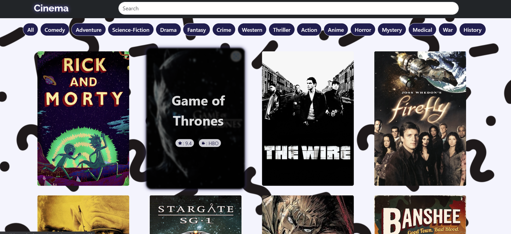

# Shows site

## Description

A fullstack application that allows users to search for TV shows and get information about them.

## Table of Contents

- [Live Demo](#live-demo---shows-site)
- [Installation](#installation)
- [Technologies](#technologies)
- [Features](#features)
- [Contributing](#contributing)
- [License](#license)

## Live Demo - [Shows site](https://shows-site-frontend.onrender.com/)

- frontend - Render
- backend - Render
- database - MongoDB Atlas

## Screenshots

	

  

  

## Installation

1. Clone the repository to your local machine.
2. Install frontend and backend dependencies: `npm install` or `yarn install`
3. Create a mongodb database or run the docker-compose file in the backend folder: `docker-compose up -d`.
4. Create a `.env` file in the backend folder and fill its variables.
5. Start the development server: `npm start` or `yarn start`
6. Open [http://localhost:3000](http://localhost:3000) to view it in the browser.

## Technologies

- **[React](https://reactjs.org/)** - A JavaScript library for building user interfaces.
- **[React Router](https://reactrouter.com/web/guides/quick-start)** - A collection of navigational components that compose declaratively with your application.
- **[React Bootstrap](https://react-bootstrap.github.io/)** - The most popular front-end framework, rebuilt for React.
- **[Node.js](https://nodejs.org/en/)** - A JavaScript runtime built on Chrome's V8 JavaScript engine.
- **[Express](https://expressjs.com/)** - A fast, unopinionated, minimalist web framework for Node.js.
- **[Mongo](https://www.mongodb.com/)** - A general purpose, document-based, distributed database built for modern application developers and for the cloud era.
- **[Mongoose](https://mongoosejs.com/)** - A MongoDB object modeling tool designed to work in an asynchronous environment.

## Features

- Search for TV shows.
- Get information about specific TV show.
- Get TV shows with the same genre.
- Get the link to watch the TV show.

## Contributing

- Fork the repository.
- Clone the repository to your local machine.
- Create a branch with your updates: `git checkout -b <branch-name>`
- Make your changes and commit them: `git commit -m '<commit-message>'`
- Push your changes to the branch: `git push origin <branch-name>`
- Open a pull request to the `main` branch.

## License

This project is licensed under the [MIT License](LICENSE).
